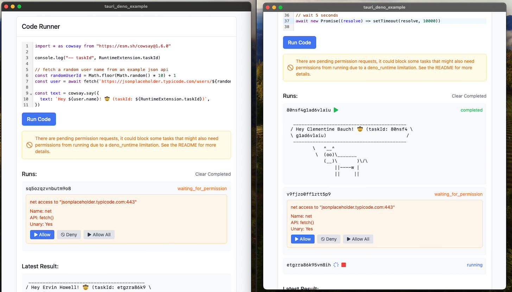

# Run Deno tasks with Tauri



Example of using Tauri with `deno_runtime` to run multiple tasks in parallel. This repo showcases parallel code execution, cancelling tasks, and polling for results.

I use channels to stop tasks and hashmaps to store the return values and handles of the tasks.

Run it with:

```bash
pnpm tauri dev
```
