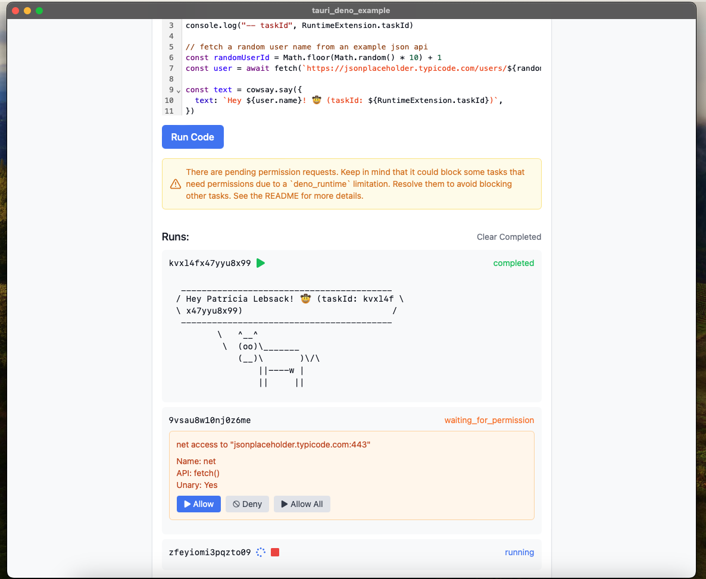

# Run Deno tasks with Tauri



Example of using Tauri with `deno_runtime` to run multiple tasks in parallel. This repo showcases parallel code execution, stopping tasks, handling permissions, and getting results.

I use channels to stop tasks and hashmaps to store the return values and handles of the tasks. This repo also showcases how to get around some limitations of the `deno_runtime` crate such as having only one global permissions prompter and still being able to handle permission prompts from multiple threads.

Run it with:

```bash
pnpm tauri dev
```
